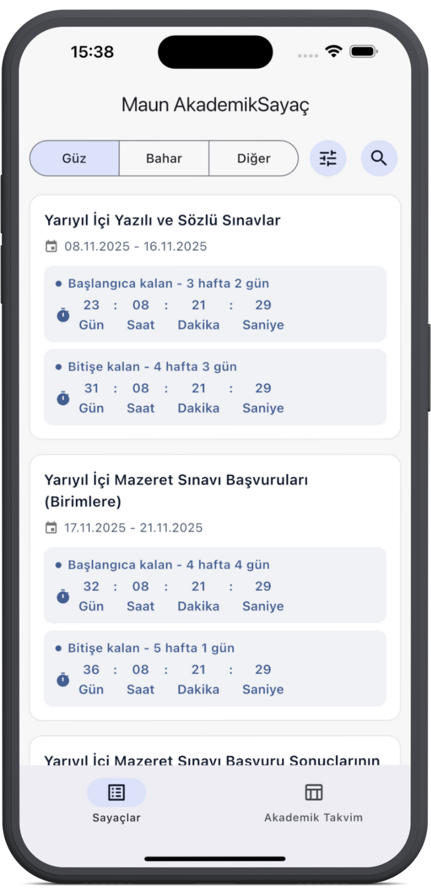
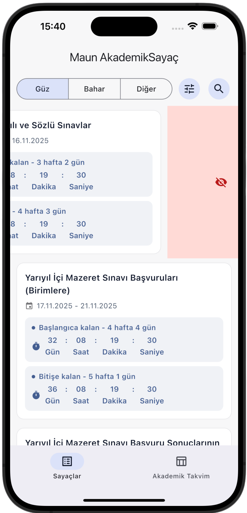
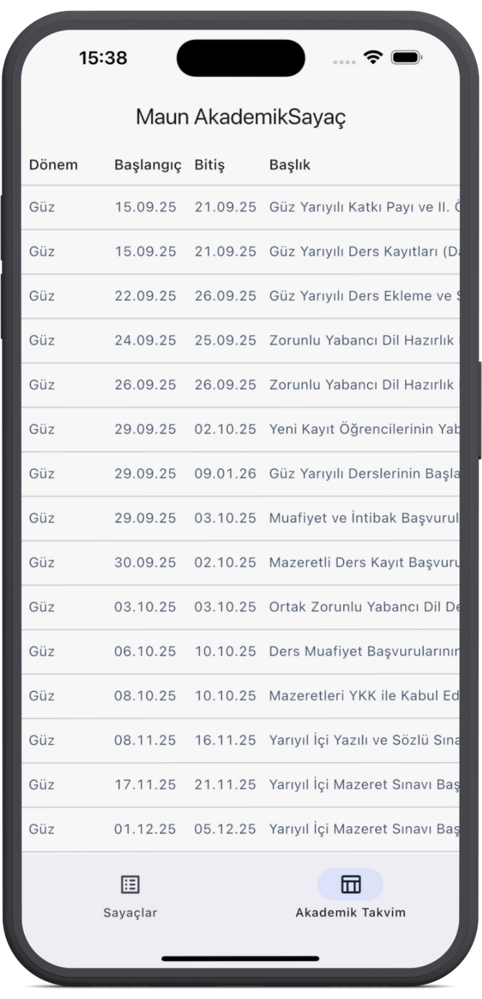
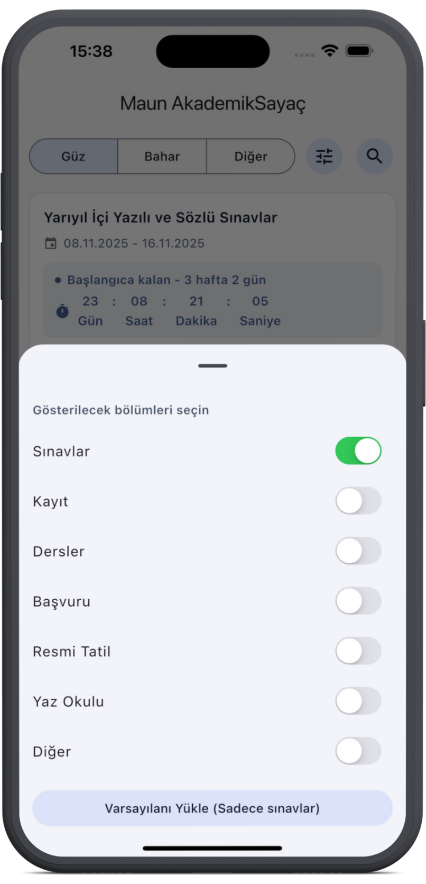

# MaunSayaç

MAUN (Muş Alparslan Üniversitesi) akademik takvimi için geri sayım uygulaması.

## Özellikler

- Akademik etkinlikler için geri sayım sayacı
- Etkinlikleri dönemlere göre filtreleme (Güz/Bahar/Diğer)
- Etkinlik kategorilerine göre filtreleme
- İstenmeyen etkinlikleri kaydırarak gizleme
- Etkinlik arama özelliği
- Tam akademik takvim görünümü
- Etkinliklere kalan süreyi hafta ve gün olarak gösterme
- Otomatik renk kodlaması:
  - Kırmızı: Son 3 gün
  - Turuncu: Son 14 gün
  - Mavi: Diğer zamanlar

## Ekran Görüntüleri

  
  
  
  

## Kullanılan Teknolojiler

- Flutter
- Material 3 Design
- Shared Preferences (Yerel depolama)
- Timer Countdown
